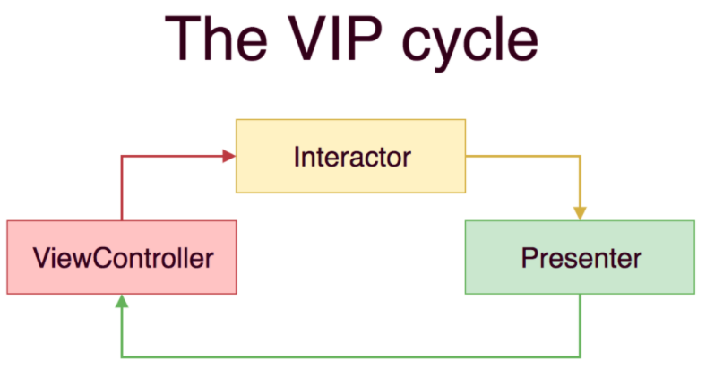

# VIP Architecture
> VIP Architecture also called "Clean Swift Architecture". It is a set of Xcode templates to generate the Clean Architecture components for you

## What is VIP Architecture

- VIP is very similar to the VIPER as both originated from Uncle Bob's Clean Architecture ideas

- The VIP diagramas describes its main structure, which explains its acronym definition: the ViewController/Interactor/Presenter relationship

## Why to use VIP Architecture

- The main goals for VIP architecture are Testability and to fix the Massive View Controller problem. So,we can create clean and modular code here

- VIP architecture helps to isolate business logic in one layer, instead of having it spread all over the code.

- If we compare VIP with other design patterns, it gives less coupling in code base and many more advantages
For example,
We are working on a project which is using MVC pattern and day by day the app is becoming larger and more complex. either, it is quite impossible to be maintained with MVC or a massive view controller problem may come.
But, If we go with VIP then this problem could be resolved.

- Due to separation of code, Unit testing become much easier 

## VIP Sample Project

- Refer VIPDemo app
End to end VIP architecture is implemented in the 'UserList' module. Let's understand it in brief.

I have used Builder as an extra component. I also have implemented protocol orianted approach.

### Builder
- Builder will responsible for initializing the instance of all the component
- Instead of initializing all VIP parts inside a ViewController or a previous Routers, I have created class called builder to put all init code for a module
- In our demo app, builder will initialise the instances of Interactor, Presenter and Router

### Interactor
- Interactor will responsible for declaring business logic and handle network calls or database queries
- In our demo app, Interactor calls an API and handles the response. Response model get created and pass this model to the Presenter.

### Presenter
- Presenter will responsible for building presentation logic. This component decides how the data will be presented to the user
- In our demo app, we do not have required transformation from response model (or data) to display model. because viewcontroller display data as it is

### ViewController
- ViewController will communicate with the Interactor, and get a response back from the Presenter. Also, when there is a need for transition, it will communicate with the Router.

### Router
- The router takes care of the transition and passing data between view controllers.
- In our demo app, router will navigate 'UserListViewController' to 'UserDetailsViewController' with some data
